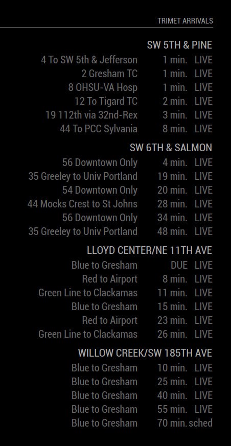

# MMM-Trimet


This [MagicMirror](https://magicmirror.builders/) module retrieves data from
Portland, Oregon's Trimet transit group, and displays the upcoming arrivals to
up to 10 stops. This will require you to get your own Trimet developer AppID,
but this is free and relatively painless.

* Get a Trimet AppID: https://developer.trimet.org/appid/registration/
* Find out more about Trimet's Developer Resources: https://developer.trimet.org/

# Initial Setup
## Install MagicMirror From Source
Find more information about this on MagicMirror's website: https://magicmirror.builders/

## Download This Module
```bash
cd MagicMirror/modules
git clone https://github.com/shortword/MMM-Trimet.git
```

## Configure The Module

1. Return to the MagicMirror root directory: `cd ../`
1. Setup the master MagicMirror config file in `config/`
  * For more info, see: https://github.com/MichMich/MagicMirror#configuration
1. Add a section for MMM-Trimet in the `config.modules` section of the JSON file

### Minimum Required

The minimum required configuration section will look something like this:
```
{
    module: "MMM-Trimet",
    position: "top_right",      // Replace with your preferred location
    header: "Trimet Arrivals",  // Not a hard requirement, but useful for multiple stop setups
    config: {
        appId: "REPLACE_WITH_YOUR_APPID"    // <--- Hey, you'll have to replace this
    }
}
```

### Additional Config Options

There are also additional `config` options which you can set, and will almost certainly
want to (otherwise you'll just get the default example stops).

Key | Default | Description | Expected Type
----|---------|-------------|--------------
`arrivalCount` | 2 | A minimum number of arrivals to retrieve | positive int
`arrivalURL` | "https://developer.trimet.org/ws/v2/arrivals" | Trimet's arrival URL | string
`maxTotalArrivals` | 6 | Maximum number of arrivals to display for each stop | positive int
`maxStopNameLen` | 25 | Max number of letters to display in a stop name (they can be quite long) | positive int
`minutes` | 20 | Get arrivals for this many minutes plus one more arrival; `maxTotalArrivals` will override this if more arrivals are retrieved in this timeframe | positive int
`stopIds` | [7631, 7789, 8343, 9831] | Up to 10 Trimet stop IDs; find numbers [here](https://trimet.org/ride/stop_select_form.html) | list of ints
`updateInterval` | 15000 | How often to update in ms. Default is every 15s | positive int

`stopNameMap` | {} | Optional mapping of stopId (string) -> friendly display name. Keys must be strings (e.g. "6402"). If present, the mapped name will be used instead of the API-provided location description. | object

### stopNameMap example

You can override the stop labels displayed by the module by adding a `stopNameMap` object to the module `config` in your `config/config.js`. Keys should be strings containing the stop ID and values are the friendly names you want shown.

Example configuration:

```js
{
  module: "MMM-Trimet",
  position: "top_right",
  config: {
    appId: "REPLACE_WITH_YOUR_APPID",
    stopIds: [6402, 6403],
    stopNameMap: {
      "6402": "Our House Side (to 75 Bus)",
      "6403": "Reed College Side (to Orange Line MAX)"
    }
  }
}
```

Notes and behavior:

- The module will prefer `stopNameMap` values (string keys) when rendering stop names. If a mapping entry is missing, it falls back to the Trimet API's location description.
- Mapped names are truncated to the configured `maxStopNameLen` (default 25). Increase `maxStopNameLen` in the module source or configuration if you need longer labels.
- A backup of the original module file was created when this feature was added: `modules/MMM-Trimet/MMM-Trimet.js.bak`. Restore it if you want to revert to the prior behavior.
- After changing `config.js`, restart MagicMirror (or `pm2 restart mm`) to apply the change.

